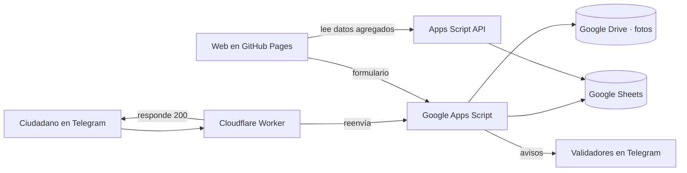

# AlertaDengue

Sistema ciudadano y gratuito de alerta temprana de dengue en República Dominicana. La ciudadanía reporta **criaderos de mosquitos** y **procesos febriles de forma anónima**. Con esos reportes se construye un mapa público que muestra dónde hace falta limpiar, prevenir y reforzar la atención.

- **Bot de Telegram:** [@AlertaDengueRDbot](https://t.me/AlertaDengueRDbot)
- **Piloto:** municipio de La Vega
- **Coordinación y desarrollo:** Dr. Frank Betances Reinoso
- **Contacto:** frank.alberto.betances.reinoso@gmail.com

> AlertaDengue no diagnostica ni sustituye la atención médica ni la vigilancia epidemiológica oficial: la complementa con información más rápida y más cercana al barrio. En una emergencia, llama al 911.

---

## Cómo funciona

El sistema trabaja en dos capas separadas por diseño.

**Criaderos.** Cualquier persona puede reportar un lugar con agua estancada o basura acumulada, con su ubicación y una foto opcional. Antes de aparecer en el mapa, el reporte se confirma: lo revisa un validador o lo reporta otra persona distinta en el mismo punto. Cuando el lugar se limpia, se marca como atendido.

**Fiebre.** Cualquier persona puede notificar de forma anónima que alguien en su casa tiene fiebre. Solo se guardan el sector, el rango de edad y los síntomas. Los reportes se publican sumados por sector, y únicamente cuando hay 5 o más en los últimos 7 días. Una zona cambia de nivel cuando la fiebre reportada supera claramente lo habitual en ella misma. Quien notifica recibe al instante los signos de alarma del dengue y la indicación de acudir a un centro de salud.

| Nivel en el mapa | Significado |
|---|---|
| 🔴 Zona prioritaria | La fiebre reportada supera claramente lo habitual |
| 🟠 En vigilancia | La fiebre reportada empieza a subir |
| 🟢 Sin aumento | Sin señal de aumento |
| ⚪ Sin datos | Datos insuficientes |

## Arquitectura



El Worker de Cloudflare existe porque Apps Script responde a los webhooks con una redirección HTTP 302. Telegram la interpreta como un error y bloquea los mensajes siguientes. El Worker responde a Telegram al instante y reenvía el mensaje a Apps Script en segundo plano.

## Stack

| Capa | Tecnología |
|---|---|
| Canal ciudadano | Telegram Bot API |
| Intermediario del webhook | Cloudflare Workers |
| Backend y API | Google Apps Script (V8) |
| Datos | Google Sheets y Google Drive |
| Web | HTML, CSS y JavaScript estáticos en GitHub Pages |
| Mapa | Leaflet y OpenStreetMap |
| Análisis | Google Colab |

Todo funciona con planes gratuitos.

## Estructura del repositorio

```
index.html                  Web pública: mapa, cifras, formulario y signos de alarma
apps-script/Code.gs         Backend: bot, formulario, agregación, API y resumen semanal
apps-script/appsscript.json Manifiesto de Apps Script
cloudflare/worker.js        Intermediario entre Telegram y Apps Script
```

`index.html` debe permanecer en la raíz para que GitHub Pages lo publique.

## Despliegue

Ningún valor secreto (token, claves) se escribe en el código ni en este repositorio. Todos se guardan en las **propiedades del script** de Apps Script o en los **secretos** de Cloudflare.

**1. Bot.** En Telegram, crea el bot con @BotFather (`/newbot`) y guarda el token.

**2. Proyecto de Apps Script.** En script.google.com, crea un proyecto y pega `Code.gs`. En Configuración del proyecto, activa el manifiesto y sustituye `appsscript.json`.

**3. Token.** En Propiedades de secuencia de comandos, añade `TELEGRAM_TOKEN`.

**4. Instalación.** Ejecuta `setup()` y autoriza los permisos. Se crean la hoja de datos, la carpeta de fotos, las claves internas, una cuadrícula demo de sectores y los disparadores (agregación cada hora y resumen semanal los lunes a las 8:00).

**5. Aplicación web.** Implementar → Nueva implementación → Aplicación web. Ejecutar como: Yo. Acceso: Cualquier usuario. Guarda la URL `/exec` como propiedad `WEBAPP_URL`.

**6. Claves para el Worker.** Ejecuta `prepararWorker()`. El registro mostrará dos valores, `GAS_URL` y `TG_SECRET`. No los compartas.

**7. Worker.** En Cloudflare, ve a Workers & Pages → Create Worker, pega `cloudflare/worker.js` y despliega. En Settings → Variables and Secrets, añade `GAS_URL` y `TG_SECRET` como secretos.

**8. Webhook.** Guarda la dirección del Worker como propiedad `WORKER_URL`. Ejecuta `configurarWebhookWorker()` y comprueba el resultado con `estadoWebhook()`: no debe aparecer `last_error_message`. Un subdominio `workers.dev` recién creado puede tardar unos minutos en ser visible para Telegram (error `Failed to resolve host`).

**9. Validadores.** Cada validador escribe `/miid` al bot. Guarda los identificadores, separados por comas, en la propiedad `ADMIN_CHAT_IDS`.

**10. Web.** En `index.html`, pon la URL `/exec` en `API_URL` y el usuario del bot en `BOT_USERNAME`. Activa Settings → Pages → Deploy from a branch → `main` / root.

**Datos de demostración.** `generarDatosDemo()` los carga y `borrarDatosDemo()` los elimina. Si `API_URL` está vacío, la web muestra datos simulados generados en el navegador.

### Reglas de mantenimiento

- **Cambios en `doPost` o `doGet`.** Publícalos con Gestionar implementaciones → editar → Nueva versión. Una implementación nueva cambiaría la URL `/exec` y rompería el Worker y la web.
- **No uses `configurarWebhook()`.** Conecta Telegram directamente con Apps Script y reproduce el error 302. Usa siempre `configurarWebhookWorker()`.
- **Si cambias `WEBHOOK_SECRET`,** actualiza también el secreto `GAS_URL` en Cloudflare.
- **Sectores reales.** Para sustituir la cuadrícula demo, usa `importarSectoresGeoJSON(fileId, campoId, campoNombre)` con un GeoJSON guardado en Drive.
- **Errores del bot.** Aparecen en Apps Script → Ejecuciones. Una ejecución marcada como completada puede contener errores registrados en su detalle.

## Privacidad

El tratamiento de datos se ajusta a la Ley 172-13 sobre protección de datos personales de República Dominicana. El diseño minimiza los datos desde el origen:

- No se guardan nombres ni teléfonos, y cada usuario se identifica con un código cifrado.
- De los reportes de fiebre solo se conserva el sector. En la web, la ubicación no sale del dispositivo.
- La API pública devuelve únicamente datos agregados y criaderos validados.
- Los recuentos inferiores a 5 no se publican.
- Las fotos de criaderos solo las ven los validadores.
- Hay límites de envío y protección básica contra envíos automatizados.

## Estado

Piloto en desarrollo en La Vega. Los mensajes sanitarios del sistema se someterán a validación por la autoridad sanitaria antes de su apertura al público.
